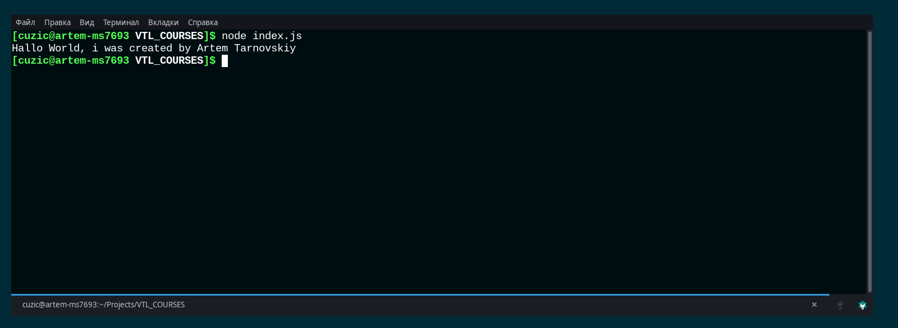
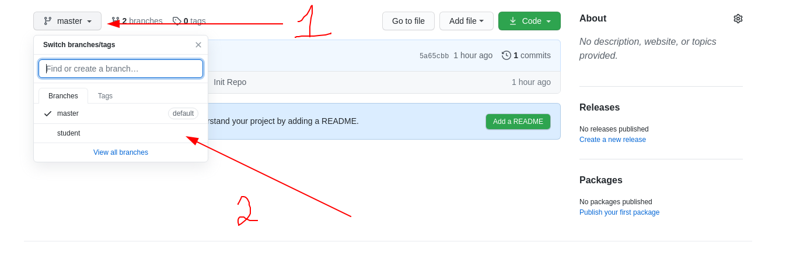
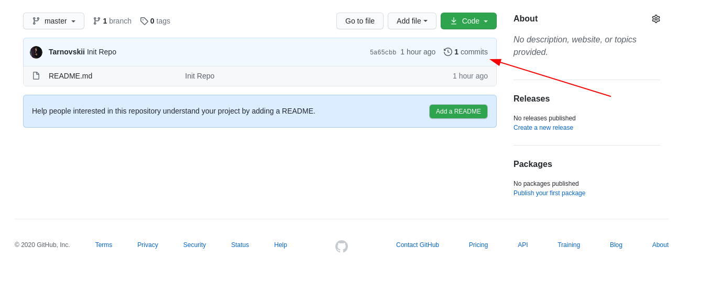

# 1. Introduction

<hr/>

Before you begin your work in this course, you need to become more familiar with SLI.

SLI - Command line interface. It is needed for more convenient and flexible interaction with the system, programs and other utilities on your OS.

In order to open SLI on your computer, go to the folder that you created for this course (example C: / ProgrammFiles / VTLSurses /).

If you are working on Windows OS, then at the top of the explorer window, where the address of the current folder is indicated, erase everything and write cmd, then press Enter.

If you are working on Linux OS, then open right-click menu in the explorer window and select Terminal

\# - Command ("#clear" means, that you should write "clear" in your CLI)<br/>
// - An inline comment (anything after the "//" character should not be used) <br/>
/\* \*/ - A multi-line comment (anything betwen "/\*" and "\*\" should not be used) 

## 2. Preparation for work

<hr/>

	#git init // Initializing an empty repository
	#git remote add origin {repoUrl} // Linking a remote repository to a local one
	#git pull origin master // Update local repository data from remote repository
	#git checkout student // Creating new branch for work

## 3. Hello World

<hr/>

	#touch index.js // Creating new file named "index.js" in current folder
	
Open file index.js in any text editor <br/>
Lets write there a few lines:
```javascript
let myName = "YOUR_NAME";
console.log(`Hallo World, i was created by ${myName}`);
```
Save and close file. Go to CLI and write there 
	
	#node index.js
	
You should have a similar result



## 4. Commit and push

<hr/>

	#git add index.js // Adding index.js to changelog of current repo
	#git commit -m "My first commit" // confirm the changes with a message "My first commit"
	#git push // Writing the current version to the remote repository
	
Got to GitHub and switch your branch from master to student



You can see or everything worked out here

